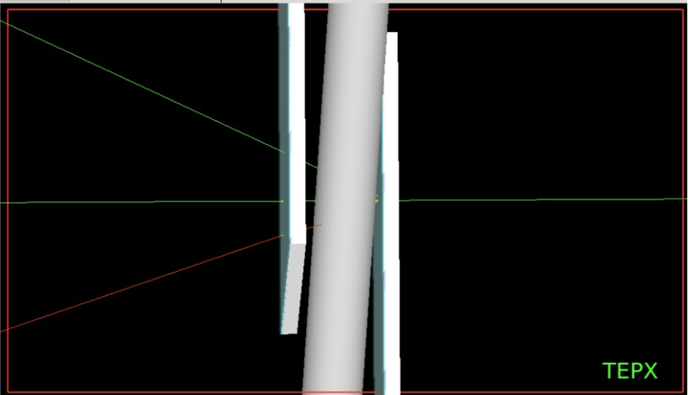

# Simulation of CERN LHC TEPX Silicon Pixel Detector for HL-LHC upgrade

## Investigation of tracking efficiency and the effect of the cooling pipe

### Introduction

At the High-Luminosity LHC (expected to become operational in 2027) on average 140-200 proton-proton collisions will happen in every bunch crossin, i.e. in every 25 ns. This high particle flux requires highly granular and radiation hard detector technology.

The precise measurement of the collision rate is essential as it affects almost all physics measurements carried out at the LHC. To reach the target precision of 1%, the detector must provide a linear response over more than 4 orders of magnitude in luminosity as well as excellent stability and high availability over the full data taking period.

The CMS collaboration chosen Silicon Pixel detector technology to answer the technological challenges. These detectors however need to be kept cold to operate with low noise in the LHC environment. The current plans place the cooling pipes between the detectors. While it has the advantage of efficient cooling, the cooling pipes might scatter or absorb the particles that we want to measure. 

The aim of the project is to quantify this effect with the help of the Geant4 particle physics simulation which was developed at ELTE.

### Project plan

Step 1: Install Geant4 [3]. A guide on installation can be found:
https://sites.google.com/view/geant4elte/how-to-install-geant4

Step 2: Download the TEPX simulation source code which was developed at ELTE, compile it and visualize the geometry of the detector elements in the Geant4 simulation.

Step 3: The detectors and the cooling pipes are included in the simulation. The task of the student is to include CO2 (the two phase cooling material in the pipes) in the simulation.

Step 4: Install ROOT [4]
Develop an analysis code that analyzes the output of the Geant4 simulation. This should be automatized as different types of particles and several particle energies need to be investigated.

Step 5: Run the simulation and the consequent analysis code developed in step 4 to understand the effect of the beam pipe for different energies and particles on the efficiency and fake rate of finding coincidences in the overlapping detector layers.

### References

[1] https://www.researchgate.net/publication/323786425_Beam-dynamic_effects_at_the_CMS_BRIL_van_der_Meer_scans

[2] https://arxiv.org/pdf/1806.11245.pdf

[3] https://geant4.web.cern.ch/

[4] https://root.cern.ch/

### Contacts

Gabriella.Pasztor@ttk.elte.hu and galgoczi@caesar.elte.hu
