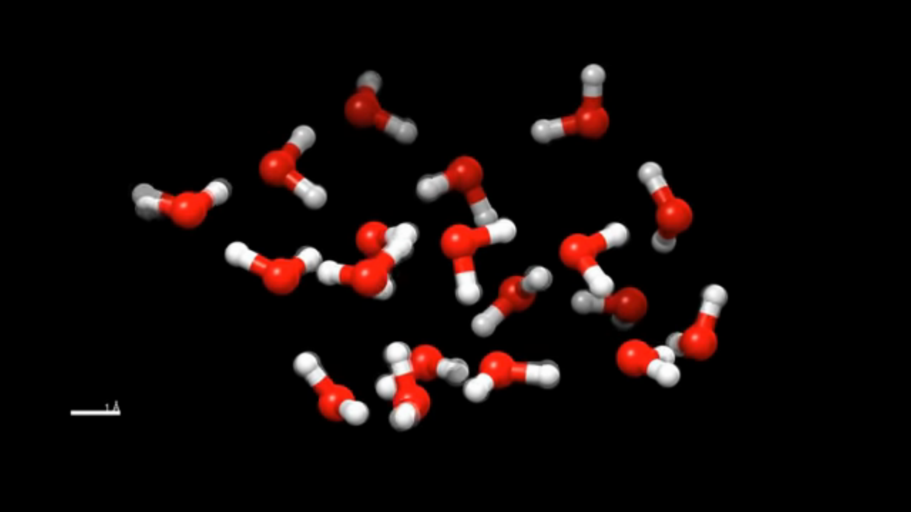

## Classical Molecular Dynamics (MD) Simulation with LAMMPS

Simulating the dynamics of atoms, molecules and bulk materials can be done on many length scales with more or less detailed models. In this tutorial we treat the atoms as point particles and describe their interactions classically. LAMMPS will calculate the forces acting on each atom and moves them by a predefined timestep and so we can observe the dynamics of a couple of thousand of atoms. From these simulations we will be able to calculate statistical averages of physical quantities, potential energy surfaces, diffusion constants, phonon dispersions and so on.

I recommend to use LAMMPS for this tutorial https://lammps.sandia.gov/ , but there are several other popular packages to perform the simulations.

You will need to use forcefield parameters in order to run the simulations. Next to the LAMMPS source code you will find some files in the `potentials` directory. We will need only the **REAXFF**, **Tersoff** and **COMB3** forcefield parameters.

1. Read the documentation of LAMMPS and Install it

2. a, Run the examples of `in.comb.Si` and `in.comb.Si.elastic`in the `examples/comb` directory   
b, Run the examples of `AuO` and `CHO` in the `examples/reax` directory. Take a look into the papers mentioned in the `README` file for each example  
c, Try to visualize the movements of atoms! You can use VMD[https://www.ks.uiuc.edu/Research/vmd/] or other softwares.

3. a, Calculate an O_2 molecule's dissociation energy using an MD simulation with the **REAXFF** forcefield 
b, Calculate the dissociation energy of a hydrogen atom from methane (CH_4)  
c, Compare your results with the literature!

4. a, Calculate vibrational modes with the **Tersoff** forcefield 
b, Create a periodic single wall carbon nanotube (SWCNT) and calculate the vibrational modes!  
c, What parameters limit the accuracy of the calculation? Determine limiting parameters and run simulations for different set of these parameters!  
d, Calculate the vibrational modes of a CNT with vacancies! 
https://journals.aps.org/prb/pdf/10.1103/PhysRevB.69.235409  
https://www.youtube.com/watch?v=YXQ0gZr0kkI  
https://www.youtube.com/watch?v=3NmrxLbBx60  

5. Simulating water  
https://www.youtube.com/watch?v=IGEP-u1PNX0  
https://www.youtube.com/watch?v=NQhjAtCKghE&list=PLEdP7cCNp3PpNfrVieARvrXMtCdp1L7yU&t=0s&index=44  
a, Create a box of water  
b, Equilibrate the system with the proper thermostat 
c, What is the equilibrium density of water at `300K` with **REAX** and **COMB** forcefields?  
d, Is there difference of radial and angle distribution functions with the two models?
https://www.ncbi.nlm.nih.gov/pmc/articles/PMC6175054/
https://www.researchgate.net/profile/Ashu_Choudhary4/post/Can_anybody_guide_me_to_calculate_Spatial_distribution_function/attachment/59d622726cda7b8083a1c262/AS%3A273533098233860%401442226780198/download/JChemPhys_99_3049.pdf

Many of the above calculated properties are well documented in the literature, therefore for each section write a brief report of your findings in comparison with the results of others!

[] https://www.isis.stfc.ac.uk/Pages/md-lecture-1.pdf
