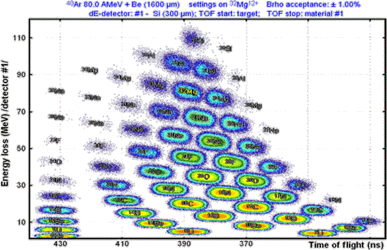

# THIS PROJECT IS HERE ONLY FOR ARCHIVING PURPOSES, YOU CANNOT CHOOSE IT IN THIS YEAR

Nuclear and Particle Physics simulation software packages II.

LISE++

1. Installation

Download from http://lise.nscl.msu.edu/lise.html,
then follow the installation description.
Check if there is some output for a simple close to blank setup. 
Read the suggested lecture notes of Oleg Tarasov, published on the website. 

2. Run predefined settings

Download lpp files from the web. You can find these for almost all 
radioactive beam producing accelerator laboratories. Try to produce a 
radioactive beam of 11Li at some setup. In the following 3 task use the 
same beam at the same lab. 

3. Changing the fragment separator setup  

The task for this week is to make changes in the fragment separator 
setup and overview the changes. The variable parameters are: Brho values of the 
diploes, thickness of the production target and the properties of the wedge 
located in the middle of the fragment separator system. 
The output of this overview is a documentation about which changes result in a rise or 
a fall of the secondary beam intensity. 

4. Examine the momentum distributions properties in the stages of the fragment separator

Produce momentum distributions at the different stages. Export the distributions 
as text files out of the software and analyze them using a software like gnuplot, 
or anything else. The question is the width of the beam. 
Change the momentum slit property, and analyze the resulting momentum distributions. 

5. Examine the the isotope identification properties after the separator at 
several setup parameters

Produce dE - TOF 2D histograms using the LISE++. Reproduce the lise3.gif example file 
as much as you can. Try to increase the secondary beam intensity and check the merit 
of the isotope separation during that. 

6. Run Action

Plan some beam of exotic nuclei using a choosen lise input parameter set of a lab. 
Try to produce at least 1 particle per second beam intensity of as heavy isotopes 
of carbon and iron as you can.  

7. Data analysis

Run the software for a couple laboratory setups. Compare the results, 
like RIKEN vs. FRIB or NSCL.  The parameters to compare are beam intensities 
of heavier iron isotopes or r-process nuclei. (Read the web for what are the 
estimates for r-process nuclei.)   

8. Plan az experiment 

Plan an experiment of measurng the hald lives of the exotic nuclei. 
a) produce a beam of it, b) estimate the rate, c) assume a half live from nudat2 
database, and try to simulate the data what you would detect and estimate the 
uncertainty of the half live to be determined. 

9. Evaluation of complex detector system data

Try to develop the beamline detector setup. Change values and try to increase beam 
purity for extremly proton rich and extremely neuton rich isotopes. 

10. Construct overviewing plots 

Try to run the software for several adjustment of different secondary beam isotopes and 
construct plots that describe the overall behavior of the secondary beam production at 
one laboratory (e.g. in RIKEN)
